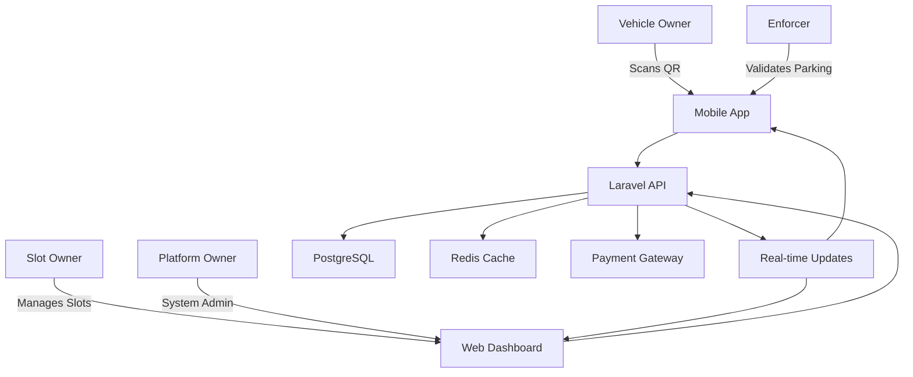

# 🅿️ Parking Papi - Street Parking Platform

A comprehensive three-sided marketplace connecting vehicle owners, parking slot owners, and platform operators through real-time QR code-based parking, payment processing, and AI-powered analytics.

## 🌟 Features

### For Vehicle Owners
- 📍 **Smart Location Search**: Find available parking slots nearby with real-time availability
- 📱 **QR Code Scanning**: Instant booking through mobile camera scanning
- 💳 **Digital Wallet**: Secure payments with auto top-up and loyalty points
- 🔔 **Smart Notifications**: Parking expiration alerts and session management
- 🌐 **Offline Support**: Continue using the app even without internet connection

### For Slot Owners
- 🏢 **Slot Management**: Easy registration and management of parking spaces
- 📊 **Performance Analytics**: Revenue tracking, occupancy rates, and optimization insights
- 💰 **Automated Payouts**: Seamless commission-based revenue distribution
- 📈 **Demand Forecasting**: AI-powered insights for pricing optimization

### For Platform Operators
- 🎯 **Comprehensive Dashboard**: Full platform oversight and management
- 📊 **Advanced Analytics**: User behavior, revenue forecasting, and system health
- 🔧 **System Administration**: User management, dispute resolution, and configuration
- 🚨 **Real-time Monitoring**: Live system metrics and automated alerts

## 🛠 Tech Stack

### Backend
- **Laravel 11.x** with PHP 8.3
- **PostgreSQL 17** with geospatial queries
- **Redis** for caching and sessions
- **Laravel Reverb** for real-time WebSocket connections
- **Laravel Horizon** for queue management
- **Laravel Sanctum** for API authentication

### Frontend
- **Inertia.js v2** for seamless SPA experience
- **React 18** with TypeScript 5.x
- **Tailwind CSS** for responsive design
- **Zustand** for state management
- **PWA** with offline-first architecture

### Mobile
- **Expo React Native** for cross-platform mobile
- **expo-camera** for QR code scanning
- **expo-location** for geolocation services
- **SQLite** for offline data storage

### Infrastructure
- **Laravel Cloud** for backend deployment
- **EAS (Expo Application Services)** for mobile deployment
- **GitHub Actions** for CI/CD automation
- **PostgreSQL 17** managed database
- **Redis** managed cache

## 🚀 Quick Start

### Prerequisites

- PHP 8.3+
- Node.js 20+
- PostgreSQL 17
- Redis
- Composer
- npm/yarn

### Installation

```bash
# Clone the repository
git clone https://github.com/your-username/parking-papi.git
cd parking-papi

# Install backend dependencies
composer install

# Install frontend dependencies
npm install

# Set up environment
cp .env.example .env
php artisan key:generate

# Set up database
php artisan migrate
php artisan db:seed

# Install mobile app dependencies
cd mobile/expo-app
npm install
cd ../..

# Start development servers
php artisan serve
npm run dev

# Start mobile development
cd mobile/expo-app
npx expo start
```

### Environment Configuration

Copy `.env.example` to `.env` and configure:

```bash
# Database
DB_CONNECTION=pgsql
DB_HOST=127.0.0.1
DB_PORT=5432
DB_DATABASE=parking_papi
DB_USERNAME=your_username
DB_PASSWORD=your_password

# Redis
REDIS_HOST=127.0.0.1
REDIS_PASSWORD=null
REDIS_PORT=6379

# Payment Gateway
MAGPIE_API_KEY=your_magpie_api_key
MAGPIE_WEBHOOK_SECRET=your_webhook_secret

# SMS Service
TWILIO_SID=your_twilio_sid
TWILIO_AUTH_TOKEN=your_twilio_token
TWILIO_PHONE_NUMBER=your_twilio_number
```

## 📱 Mobile App Setup

The mobile app is built with Expo and supports both iOS and Android:

```bash
cd mobile/expo-app

# Development build
eas build --profile development --platform all

# Preview build for testing
eas build --profile preview --platform all

# Production build for app stores
eas build --profile production --platform all
```

## 🏗 Architecture

### Database Schema

```sql
-- Core entities with UUID primary keys
users (id, email, role, mobile_number, wallet_balance)
parking_slots (id, owner_id, location, status, hourly_rate)
parking_sessions (id, user_id, slot_id, status, confirmation_code)
payment_transactions (id, session_id, amount, platform_commission)
qr_codes (id, slot_id, data, expires_at)
```

### API Endpoints

```bash
# Authentication
POST /api/auth/register - User registration with OTP
POST /api/auth/login - Sanctum token authentication
POST /api/auth/verify-otp - Mobile verification

# Parking Operations
GET /api/parking-slots/nearby - Find available slots
POST /api/qr/scan - Process QR code scan
POST /api/qr/activate-payment - Complete booking
PUT /api/parking-sessions/{id}/extend - Extend session

# Analytics
GET /api/analytics/slot-performance - Revenue and occupancy
GET /api/analytics/revenue - Financial breakdowns
GET /api/analytics/platform-health - System KPIs
```

### Real-time Features

```javascript
// WebSocket channels for live updates
Echo.channel('parking-area-1')
  .listen('SlotStatusChanged', (e) => {
    updateSlotStatus(e.slot_id, e.status);
  });

Echo.private('user.123')
  .listen('ParkingExpirationWarning', (e) => {
    showNotification(`Parking expires in ${e.minutes} minutes`);
  });
```

## 🧪 Testing

### Backend Testing

```bash
# Run all tests
php artisan test

# Run specific test suites
php artisan test --testsuite=Feature
php artisan test --testsuite=Unit

# Generate coverage report
php artisan test --coverage
```

### Frontend Testing

```bash
# Run React component tests
npm test

# Run E2E tests with Playwright
npm run test:e2e

# Run performance tests
npm run test:performance
```

### Mobile Testing

```bash
cd mobile/expo-app

# Run Jest tests
npm test

# Run Detox E2E tests
npm run test:detox:ios
npm run test:detox:android
```

## 🚀 Deployment

### Laravel Cloud Deployment

1. Connect your GitHub repository to Laravel Cloud
2. Configure environment variables (see [Environment Setup](./README-ENVIRONMENT-SETUP.md))
3. Deploy automatically on push to `main` branch

### Mobile App Deployment

1. Configure EAS project settings
2. Set up GitHub Actions secrets
3. Deploy via GitHub Actions or manual EAS commands

See detailed guides:
- 📖 [Deployment Guide](./README-DEPLOYMENT.md)
- 📱 [Mobile Deployment Guide](./mobile/expo-app/README-MOBILE-DEPLOYMENT.md)
- 🔧 [Environment Setup](./README-ENVIRONMENT-SETUP.md)

## 🏛 System Architecture

### Multi-Role Design



### Data Flow

1. **Slot Registration**: Owner registers slot → Platform approval → QR generation
2. **Parking Flow**: User scans QR → Location validation → Payment → Active session
3. **Real-time Updates**: Status changes broadcast via WebSockets
4. **Analytics**: Usage data aggregated for insights and forecasting

## 🔐 Security Features

- **Role-based Access Control**: Granular permissions per user type
- **Location Validation**: GPS verification for QR code scanning
- **Concurrency Protection**: PostgreSQL advisory locks for race conditions
- **Secure Payments**: PCI-compliant payment processing
- **API Rate Limiting**: Prevent abuse and ensure fair usage
- **Data Encryption**: Sensitive data encrypted at rest and in transit

## 📊 Performance Features

- **Geospatial Optimization**: Efficient proximity queries for slot discovery
- **Intelligent Caching**: Multi-layer caching with Redis
- **Queue Processing**: Background jobs for scalable operations
- **Database Indexing**: Optimized queries for high-load scenarios
- **PWA Offline Support**: Continue usage without internet connectivity

## 🤝 Contributing

1. Fork the repository
2. Create a feature branch: `git checkout -b feature/amazing-feature`
3. Make your changes and add tests
4. Run the test suite: `php artisan test && npm test`
5. Commit your changes: `git commit -m 'Add amazing feature'`
6. Push to the branch: `git push origin feature/amazing-feature`
7. Open a Pull Request

### Development Guidelines

- Follow PSR-12 coding standards for PHP
- Use TypeScript for all new frontend code
- Write tests for all new features
- Update documentation for API changes
- Ensure mobile compatibility for all user-facing features

## 📄 License

This project is licensed under the MIT License - see the [LICENSE](LICENSE) file for details.

## 🆘 Support

- 📖 **Documentation**: Check the guides in this repository
- 🐛 **Bug Reports**: Open an issue on GitHub
- 💬 **Discussions**: Use GitHub Discussions for questions
- 📧 **Contact**: reach out for enterprise support

## 🎯 Roadmap

### Phase 1: Core Platform ✅
- [x] User authentication and role management
- [x] QR code-based parking system
- [x] Payment processing with digital wallet
- [x] Real-time slot availability updates
- [x] Mobile app with camera scanning
- [x] PWA with offline capabilities

### Phase 2: Advanced Features 🚧
- [ ] AI-powered pricing optimization
- [ ] Advanced analytics and forecasting
- [ ] Multi-language support
- [ ] Integration with smart city systems
- [ ] Carbon footprint tracking
- [ ] Electric vehicle charging integration

### Phase 3: Scale & Expansion 📋
- [ ] Multi-city deployment
- [ ] API marketplace for third-party integrations
- [ ] Advanced fraud detection
- [ ] Machine learning for demand prediction
- [ ] Blockchain-based loyalty program
- [ ] IoT sensor integration

---

**Built with ❤️ for modern urban mobility**